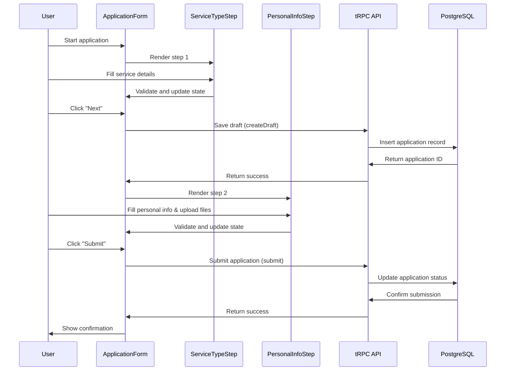

# FEAT-002: Multi-Step Visa Application Form (Steps 1-2)

## Feature Overview

Create a multi-step visa application form for Vietnam visa processing with the first two steps: Service Type Selection and Personal Information. The primary user role is visa applicants who want to submit their application details for processing. This feature implements a full frontend-to-backend flow where form data is stored in the PostgreSQL database via Prisma ORM.

## Technical Architecture Decisions

### Authentication Strategy
- **Development**: No authentication required initially
- **Future Enhancement**: Authentication system to be added in later phases
- **Current Implementation**: Use public tRPC procedures for all form operations

### File Storage Strategy
- **Development**: Local file storage in `public/uploads` directory
- **Production (Vercel)**: Vercel Blob storage for seamless deployment
  - Automatic file handling without additional configuration
  - Built-in CDN and optimized delivery
  - Simple migration path from local development
- **Implementation**: Abstract file upload logic to support both environments

### Validation Rules
- **Passport Expiry**: Must be valid for at least 6 months from Vietnam entry date
- **Age Restrictions**: Minors (under 18) must not apply alone
- **File Validation**:
  - Accepted formats: .jpg, .jpeg, .png
  - Maximum size: 5MB per file
  - Passport scans: Must include full page with clearly visible MRZ
  - Photos: Vietnam ICAO standards (face centered, white background, no hat/glasses, recent)

### Draft Persistence Strategy
- **Step Navigation**: Data persists when clicking Previous/Next buttons
- **Form State**: All entered data maintained during step transitions
- **Auto-save**: Save draft to database when moving between steps
- **Recovery**: Form data restored if user returns to application

## Component Analysis & Reuse Strategy

### Existing Components Assessment

- **`src/components/ui/Button.tsx`** - Can be reused as-is for navigation, form submission, and interactive elements
- **`src/components/layout/Navigation.tsx`** - Existing navigation; no modification needed
- **`src/app/apply/page.tsx`** - Current placeholder page; needs complete replacement with form implementation

### New Components Required

All form components need to be created from scratch as there are no existing form components in the codebase:

- **`ApplicationForm`** - Main form container with step management
- **`ServiceTypeStep`** - Step 1: Service selection fields
- **`PersonalInfoStep`** - Step 2: Personal information fields
- **`FormNavigation`** - Step navigation controls
- **`FileUpload`** - Document upload component
- **`CountrySelector`** - Searchable country dropdown
- **`DatePicker`** - Date input component
- **`ProgressIndicator`** - Form progress visualization

## Affected Files

- `[MODIFY] src/app/apply/page.tsx` - Replace placeholder with form implementation
- `[MODIFY] prisma/schema.prisma` - Add visa application database models
- `[CREATE] src/server/api/routers/application.ts` - tRPC procedures for application management
- `[MODIFY] src/server/api/root.ts` - Register application router
- `[CREATE] src/components/features/visa-form/ApplicationForm.tsx` - Main form container (Client Component)
- `[CREATE] src/components/features/visa-form/ApplicationForm.test.tsx` - Form tests
- `[CREATE] src/components/features/visa-form/ApplicationForm.visual.spec.ts` - Form visual tests
- `[CREATE] src/components/features/visa-form/ServiceTypeStep.tsx` - Step 1 component (Client Component)
- `[CREATE] src/components/features/visa-form/ServiceTypeStep.test.tsx` - Step 1 tests
- `[CREATE] src/components/features/visa-form/ServiceTypeStep.visual.spec.ts` - Step 1 visual tests
- `[CREATE] src/components/features/visa-form/PersonalInfoStep.tsx` - Step 2 component (Client Component)
- `[CREATE] src/components/features/visa-form/PersonalInfoStep.test.tsx` - Step 2 tests
- `[CREATE] src/components/features/visa-form/PersonalInfoStep.visual.spec.ts` - Step 2 visual tests
- `[CREATE] src/components/features/visa-form/FormNavigation.tsx` - Navigation controls (Client Component)
- `[CREATE] src/components/features/visa-form/FormNavigation.test.tsx` - Navigation tests
- `[CREATE] src/components/features/visa-form/ProgressIndicator.tsx` - Progress display (Server Component)
- `[CREATE] src/components/features/visa-form/ProgressIndicator.test.tsx` - Progress tests
- `[CREATE] src/components/ui/FileUpload.tsx` - File upload component (Client Component)
- `[CREATE] src/components/ui/FileUpload.test.tsx` - File upload tests
- `[CREATE] src/components/ui/FileUpload.visual.spec.ts` - File upload visual tests
- `[CREATE] src/components/ui/CountrySelector.tsx` - Country dropdown (Client Component)
- `[CREATE] src/components/ui/CountrySelector.test.tsx` - Country selector tests
- `[CREATE] src/components/ui/DatePicker.tsx` - Date input component (Client Component)
- `[CREATE] src/components/ui/DatePicker.test.tsx` - Date picker tests
- `[MODIFY] src/types/index.ts` - Add form and application types
- `[CREATE] src/lib/validations/application.ts` - Zod validation schemas
- `[CREATE] src/lib/constants/countries.ts` - Countries data
- `[CREATE] src/lib/constants/visa-options.ts` - Visa types and processing times
- `[CREATE] docs/erd.md` - Database entity relationship diagram

## Component Breakdown

### ApplicationForm Component (Client Component)
- **Name**: `ApplicationForm`
- **Location**: `src/components/features/visa-form/ApplicationForm.tsx`
- **Type**: Client Component (manages form state and step navigation)
- **Responsibility**: Main form container handling step transitions, data persistence, and submission
- **Key Props**:
  ```typescript
  interface ApplicationFormProps {
    initialData?: Partial<VisaApplicationData>;
    onSubmit?: (data: VisaApplicationData) => void;
  }
  ```
- **Child Components**: `ProgressIndicator`, `ServiceTypeStep`, `PersonalInfoStep`, `FormNavigation`

### ServiceTypeStep Component (Client Component)
- **Name**: `ServiceTypeStep`
- **Location**: `src/components/features/visa-form/ServiceTypeStep.tsx`
- **Type**: Client Component (form interactions and validation)
- **Responsibility**: Collect service type, visa duration, purpose, dates, and processing time
- **Key Props**:
  ```typescript
  interface ServiceTypeStepProps {
    data: ServiceTypeData;
    onChange: (data: ServiceTypeData) => void;
    errors: Record<string, string>;
  }
  ```
- **Child Components**: `DatePicker`

### PersonalInfoStep Component (Client Component)
- **Name**: `PersonalInfoStep`
- **Location**: `src/components/features/visa-form/PersonalInfoStep.tsx`
- **Type**: Client Component (form interactions and file uploads)
- **Responsibility**: Collect personal information, passport data, contact info, and documents
- **Key Props**:
  ```typescript
  interface PersonalInfoStepProps {
    data: PersonalInfoData;
    onChange: (data: PersonalInfoData) => void;
    errors: Record<string, string>;
  }
  ```
- **Child Components**: `CountrySelector`, `DatePicker`, `FileUpload`

### FormNavigation Component (Client Component)
- **Name**: `FormNavigation`
- **Location**: `src/components/features/visa-form/FormNavigation.tsx`
- **Type**: Client Component (button interactions)
- **Responsibility**: Handle step navigation (Previous, Next, Submit)
- **Key Props**:
  ```typescript
  interface FormNavigationProps {
    currentStep: number;
    totalSteps: number;
    onPrevious: () => void;
    onNext: () => void;
    onSubmit: () => void;
    isValid: boolean;
    isLoading: boolean;
  }
  ```
- **Child Components**: `Button`

### ProgressIndicator Component (Server Component)
- **Name**: `ProgressIndicator`
- **Location**: `src/components/features/visa-form/ProgressIndicator.tsx`
- **Type**: Server Component (static display, no interactivity)
- **Responsibility**: Display current progress and step names
- **Key Props**:
  ```typescript
  interface ProgressIndicatorProps {
    currentStep: number;
    totalSteps: number;
    stepLabels: string[];
  }
  ```
- **Child Components**: None

### FileUpload Component (Client Component)
- **Name**: `FileUpload`
- **Location**: `src/components/ui/FileUpload.tsx`
- **Type**: Client Component (file input handling)
- **Responsibility**: Handle file uploads with validation and preview
- **Key Props**:
  ```typescript
  interface FileUploadProps {
    accept: string;
    maxSize: number;
    onFileSelect: (file: File | null) => void;
    value?: File | string;
    error?: string;
    label: string;
    required?: boolean;
  }
  ```
- **Child Components**: None

### CountrySelector Component (Client Component)
- **Name**: `CountrySelector`
- **Location**: `src/components/ui/CountrySelector.tsx`
- **Type**: Client Component (searchable dropdown interaction)
- **Responsibility**: Provide searchable country selection
- **Key Props**:
  ```typescript
  interface CountrySelectorProps {
    value: string;
    onChange: (value: string) => void;
    error?: string;
    label: string;
    required?: boolean;
  }
  ```
- **Child Components**: None

### DatePicker Component (Client Component)
- **Name**: `DatePicker`
- **Location**: `src/components/ui/DatePicker.tsx`
- **Type**: Client Component (date input interaction)
- **Responsibility**: Handle date selection with validation
- **Key Props**:
  ```typescript
  interface DatePickerProps {
    value: string;
    onChange: (value: string) => void;
    error?: string;
    label: string;
    required?: boolean;
    minDate?: string;
    maxDate?: string;
  }
  ```
- **Child Components**: None

## Design Specifications

### Color Analysis

| Design Color | Semantic Purpose | Element | Implementation Method |
|--------------|-----------------|---------|------------------------|
| #3b82f6 | Primary brand/action | Submit buttons, active states | Direct hex value (#3b82f6) |
| #1e40af | Primary dark | Button hover states | Direct hex value (#1e40af) |
| #dbeafe | Primary light | Step indicators, backgrounds | Direct hex value (#dbeafe) |
| #ef4444 | Error/validation | Error messages, invalid fields | Direct hex value (#ef4444) |
| #10b981 | Success | Validation success, completed steps | Direct hex value (#10b981) |
| #f3f4f6 | Neutral background | Form containers, disabled states | Direct hex value (#f3f4f6) |
| #374151 | Primary text | Form labels, body text | Direct hex value (#374151) |
| #6b7280 | Secondary text | Helper text, placeholders | Direct hex value (#6b7280) |
| #e5e7eb | Borders | Input borders, dividers | Direct hex value (#e5e7eb) |
| #ffffff | Background | Form backgrounds, cards | Direct hex value (#ffffff) |

### Spacing System
- **Container padding**: 24px (p-6)
- **Section spacing**: 32px (space-y-8)
- **Field spacing**: 16px (space-y-4)
- **Button spacing**: 12px (gap-3)
- **Form steps gap**: 40px (gap-10)

### Visual Hierarchy
```
ApplicationForm Container (max-w-4xl, mx-auto, py-12)
├── ProgressIndicator (mb-8)
├── Form Content Container (bg-white, rounded-lg, shadow-lg, p-8)
│   ├── Step Header (mb-6)
│   ├── Step Content (space-y-6)
│   └── FormNavigation (mt-8, pt-6, border-t)
└── Debug Info (development only)
```

### Typography
- **Form titles**: text-2xl font-bold text-gray-900
- **Step headers**: text-xl font-semibold text-gray-900  
- **Field labels**: text-sm font-medium text-gray-700
- **Helper text**: text-sm text-gray-500
- **Error messages**: text-sm text-red-600
- **Body text**: text-base text-gray-900

### Visual Verification Checklist
- [ ] Progress indicator shows correct step and completion status
- [ ] Form containers have consistent white backgrounds and subtle shadows
- [ ] Input fields use consistent border styles and focus states
- [ ] Error states display red borders and error messages
- [ ] File upload areas have drag-and-drop visual feedback
- [ ] Country selector shows search functionality with proper dropdown styling
- [ ] Date inputs follow consistent styling patterns
- [ ] Navigation buttons use primary blue styling with proper hover states
- [ ] Mobile responsive layout maintains proper spacing and readability

## Data Flow & State Management

### TypeScript Types
Location: `src/types/index.ts`

```typescript
// Visa Application Types
export interface VisaApplicationData {
  serviceType: ServiceTypeData;
  personalInfo: PersonalInfoData;
  status: 'draft' | 'submitted' | 'processing' | 'approved' | 'rejected';
  createdAt: Date;
  updatedAt: Date;
}

export interface ServiceTypeData {
  numberOfApplicants: number;
  visaLength: 'evisa-1m-single' | 'evisa-1m-multiple' | 'evisa-3m-single' | 'evisa-3m-multiple';
  purposeOfTravel: 'tourist' | 'business';
  entryDate: string;
  exitDate: string;
  arrivalPort: string;
  exitPort: string;
  processingTime: 'normal' | 'urgent' | 'super-urgent' | 'express' | 'emergency' | 'weekend-holiday';
}

export interface PersonalInfoData {
  fullName: string;
  dateOfBirth: string;
  gender: 'male' | 'female';
  nationality: string;
  passportNumber: string;
  passportExpiryDate: string;
  passportPhoto?: File | string;
  portraitPhoto?: File | string;
  contactInfo: ContactInfoData;
  emergencyContact: EmergencyContactData;
  agreements: AgreementsData;
}

export interface ContactInfoData {
  fullName: string;
  phone: string;
  phoneCountryCode: string;
  primaryEmail: string;
  secondaryEmail?: string;
  homeAddress: string;
  vietnamAddress: string;
}

export interface EmergencyContactData {
  fullName: string;
  currentAddress: string;
  telephoneNumber: string;
  relationship: string;
}

export interface AgreementsData {
  informationConfirmation: boolean;
  termsAndConditions: boolean;
}
```

### State Management Strategy
- **Form State**: Use `useState` in `ApplicationForm` for current step and form data
- **Data Persistence**: Form data persists between step navigation (Previous/Next)
- **Validation State**: Use `useState` for field-level and step-level validation errors  
- **File Upload State**: Manage uploaded files in component state with File objects
- **Step Navigation**: Track current step index and validation status
- **Draft Auto-save**: Save to database on step transitions to ensure data persistence
- **No Global State**: Current feature scope doesn't require Zustand

### Data Fetching Strategy
- **Server Components**: Static content rendering (ProgressIndicator, form layout)
- **Client Components**: Form interactions, file uploads, country search
- **tRPC Integration**: Save draft applications and submit final applications
- **Database Persistence**: Auto-save drafts on step navigation for data recovery
- **File Storage**: Local development storage with Vercel Blob for production deployment

## API Endpoints & Contracts

### tRPC Procedures

#### Router: `application`
Location: `src/server/api/routers/application.ts`

##### 1. Create Draft Application (Mutation)
```typescript
createDraft: publicProcedure
  .input(z.object({
    serviceType: ServiceTypeSchema.partial(),
    personalInfo: PersonalInfoSchema.partial(),
  }))
  .mutation(async ({ ctx, input }) => {
    // Create draft application in database
    // Return application ID for subsequent updates
  })
```

##### 2. Update Application (Mutation)  
```typescript
update: publicProcedure
  .input(z.object({
    id: z.string(),
    serviceType: ServiceTypeSchema.partial().optional(),
    personalInfo: PersonalInfoSchema.partial().optional(),
  }))
  .mutation(async ({ ctx, input }) => {
    // Update existing application
    // Validate and save changes
  })
```

##### 3. Submit Application (Mutation)
```typescript
submit: publicProcedure
  .input(z.object({
    id: z.string(),
    serviceType: ServiceTypeSchema,
    personalInfo: PersonalInfoSchema,
  }))
  .mutation(async ({ ctx, input }) => {
    // Final validation and submission
    // Update status to 'submitted'
    // Trigger processing workflow
  })
```

##### 4. Get Application (Query)
```typescript
getById: publicProcedure
  .input(z.object({ id: z.string() }))
  .query(async ({ ctx, input }) => {
    // Retrieve application by ID
    // Include all related data
  })
```

### Database Schema Changes

New Prisma models to add to `prisma/schema.prisma`:

```prisma
model Application {
  id              String   @id @default(uuid())
  status          ApplicationStatus @default(DRAFT)
  numberOfApplicants Int?
  visaLength      String?
  purposeOfTravel String?
  entryDate       DateTime?
  exitDate        DateTime?
  arrivalPort     String?
  exitPort        String?
  processingTime  String?
  createdAt       DateTime @default(now())
  updatedAt       DateTime @updatedAt

  // Personal Info
  fullName        String?
  dateOfBirth     DateTime?
  gender          String?
  nationality     String?
  passportNumber  String?
  passportExpiryDate DateTime?
  passportPhotoUrl String?
  portraitPhotoUrl String?

  // Contact Info
  contactFullName String?
  phone           String?
  phoneCountryCode String?
  primaryEmail    String?
  secondaryEmail  String?
  homeAddress     String?
  vietnamAddress  String?

  // Emergency Contact
  emergencyContactName String?
  emergencyContactAddress String?
  emergencyContactPhone String?
  emergencyContactRelationship String?

  // Agreements
  informationConfirmed Boolean @default(false)
  termsAccepted       Boolean @default(false)

  @@index([status])
  @@index([createdAt])
}

enum ApplicationStatus {
  DRAFT
  SUBMITTED  
  PROCESSING
  APPROVED
  REJECTED
}
```

## Integration Diagram



## Styling

### Tailwind Implementation Strategy
- Use mobile-first responsive design with breakpoints: `sm:` (640px), `md:` (768px), `lg:` (1024px), `xl:` (1280px)
- Apply consistent spacing using Tailwind's scale: `4` (16px), `6` (24px), `8` (32px)
- Use semantic color palette: blue for primary actions, red for errors, gray for neutral elements
- Implement touch-friendly tap targets (minimum 44px height) for mobile compatibility

### Form Layout Patterns
```typescript
// Container layout
<div className="min-h-screen bg-gray-50 py-12">
  <div className="container mx-auto px-4">
    <div className="mx-auto max-w-4xl">
      {/* Form content */}
    </div>
  </div>
</div>

// Form card styling  
<div className="bg-white rounded-lg shadow-lg p-8">
  {/* Form content */}
</div>

// Input field styling
<input className="block w-full rounded-lg border border-gray-300 px-4 py-3 text-base transition-colors placeholder:text-gray-400 focus:border-blue-500 focus:outline-none focus:ring-2 focus:ring-blue-500 focus:ring-offset-0" />

// Error state styling
<input className="block w-full rounded-lg border border-red-300 px-4 py-3 text-base focus:border-red-500 focus:ring-2 focus:ring-red-500" />
```

### Interactive Element Styling
- **Primary buttons**: `bg-blue-600 hover:bg-blue-700 text-white px-6 py-3 rounded-lg`
- **Secondary buttons**: `bg-gray-200 hover:bg-gray-300 text-gray-900 px-6 py-3 rounded-lg`
- **File upload areas**: `border-2 border-dashed border-gray-300 hover:border-blue-400 rounded-lg p-6`
- **Progress indicators**: `bg-blue-600` for completed, `bg-gray-200` for incomplete
- **Form sections**: `space-y-6` for field groupings, `pt-6 border-t border-gray-200` for section dividers

## Testing Strategy

### Unit Tests
- **Form validation logic**: Test Zod schema validation with valid/invalid inputs
- **Step navigation**: Test step transitions and state management
- **File upload handling**: Test file validation, size limits, format restrictions
- **Country selector**: Test search functionality and selection behavior
- **Date picker**: Test date validation and format handling

### Component Tests  
- **ApplicationForm**: Test step rendering, navigation, and state persistence
- **ServiceTypeStep**: Test field rendering, validation, and data collection
- **PersonalInfoStep**: Test complex form interactions, file uploads, nested objects
- **FormNavigation**: Test button states, disable/enable logic, loading states
- **FileUpload**: Test drag-and-drop, file selection, error handling

### Integration Tests
- **tRPC procedures**: Test application creation, updates, and submissions
- **Database operations**: Test Prisma queries and data persistence
- **Form-to-API flow**: Test complete form submission workflow
- **File handling**: Test file upload and storage integration

### Visual Testing (Playwright)
**Test Files**: 
- `src/components/features/visa-form/ApplicationForm.visual.spec.ts`
- `src/components/features/visa-form/ServiceTypeStep.visual.spec.ts`  
- `src/components/features/visa-form/PersonalInfoStep.visual.spec.ts`
- `src/components/ui/FileUpload.visual.spec.ts`

**Visual Verification Requirements**:
- Test across viewport sizes: Mobile (375x667px), Tablet (768x1024px), Desktop (1280x800px), Large (1920x1080px)
- Validate exact colors using RGB assertions: primary blue (#3b82f6), error red (#ef4444), success green (#10b981)
- Validate spacing measurements: container padding (24px), field gaps (16px), section spacing (32px)
- Check typography: form titles (text-2xl), labels (text-sm), body text (text-base)
- Verify form states: default, focused, error, disabled, loading
- Test responsive behavior: mobile stacking, desktop side-by-side layouts
- Validate file upload visual feedback: drag states, upload progress, error displays

**Data Test IDs Required**:
- `data-testid="application-form-container"`
- `data-testid="progress-indicator"`
- `data-testid="service-type-step"`
- `data-testid="personal-info-step"`
- `data-testid="form-navigation"`
- `data-testid="file-upload-passport"`
- `data-testid="file-upload-portrait"`
- `data-testid="country-selector"`
- `data-testid="date-picker-entry"`
- `data-testid="submit-button"`

## Accessibility (A11y) Considerations

### Form Accessibility
- Use semantic HTML: `<form>`, `<fieldset>`, `<legend>` for form structure
- Associate labels with inputs using `for`/`id` attributes
- Implement ARIA attributes: `aria-invalid`, `aria-describedby` for validation
- Provide keyboard navigation: tab order, focus management between steps
- Use sufficient color contrast (WCAG AA): 4.5:1 for normal text, 3:1 for large text

### Screen Reader Support
- Add `aria-label` attributes for complex interactions (file upload, country search)
- Use `role="progressbar"` for step indicators with `aria-valuenow`, `aria-valuemax`
- Implement `aria-live` regions for dynamic validation messages
- Provide alternative text for uploaded images and document previews

### Keyboard Navigation
- Enable tab navigation through all interactive elements
- Implement enter/space key activation for custom components
- Support escape key for closing dropdowns and modals
- Maintain focus management when navigating between form steps

## Security Considerations

### Input Validation
- Validate all inputs server-side using Zod schemas in tRPC procedures
- Sanitize file uploads: check file types, size limits, scan for malicious content
- Implement rate limiting for form submissions to prevent spam
- Use CSRF protection for form submissions

### File Upload Security & Validation
- **Accepted Formats**: .jpg, .jpeg, .png only
- **File Size Limit**: 5MB maximum per file
- **Passport Scan Rules**:
  - Must include full page with clearly visible MRZ (ICAO code lines)
- **Photo Rules** (Vietnam ICAO passport photo standards):
  - Face straight and centered
  - White or light background
  - No hat, no glasses
  - Must be recent photo (within 6 months)
- **Security**: Store files in secure, non-executable directories with unique filenames
- **Development**: Local storage in `public/uploads`
- **Production**: Vercel Blob storage with automatic CDN delivery

### Data Protection
- Never store sensitive data in localStorage or sessionStorage
- Encrypt file uploads in transit and at rest
- Implement proper session management for draft applications
- Log security events for monitoring and compliance

## Implementation Approach

**Selected Strategy**: Phase 1 first with user confirmation before Phase 2

**Testing Strategy**: Core functionality first, then comprehensive testing

**Authentication**: No authentication required for initial implementation

**Page Structure**: Form implemented as dedicated page in `/apply` route following project structure

**File Upload**: 
- Development: Local file storage
- Production: Vercel Blob storage
- Validation: 5MB limit, .jpg/.jpeg/.png only, ICAO photo standards

**Status: ⬜ READY TO START**

**Phase 1: UI Implementation with Database Integration**

**1. Setup & Database Schema:**
- [ ] Add visa application models to `prisma/schema.prisma`
- [ ] Run Prisma migration: `npx prisma migrate dev --name add-visa-application-schema`
- [ ] Create database ERD documentation in `docs/erd.md`
- [ ] Define TypeScript interfaces in `src/types/index.ts`
- [ ] Create Zod validation schemas in `src/lib/validations/application.ts` with:
  - Passport validity: minimum 6 months from entry date
  - Age validation: minors (under 18) cannot apply alone
  - File validation: .jpg/.jpeg/.png, 5MB max, ICAO photo standards
- [ ] Set up constants files: `src/lib/constants/countries.ts`, `src/lib/constants/visa-options.ts`
- [ ] Create file upload utility supporting both local and Vercel Blob storage

**2. Core UI Components:**
- [ ] Create `DatePicker` component in `src/components/ui/DatePicker.tsx`
- [ ] Implement date input with validation and proper formatting
- [ ] Add accessibility attributes and keyboard navigation
- [ ] Create `CountrySelector` component in `src/components/ui/CountrySelector.tsx` 
- [ ] Implement searchable dropdown with country list
- [ ] Add keyboard navigation and accessibility support
- [ ] Create `FileUpload` component in `src/components/ui/FileUpload.tsx`
- [ ] Implement drag-and-drop file upload with preview
- [ ] Add file validation (type, size) and error handling
- [ ] Configure components to use mock data for initial testing

**3. Form Step Components:**
- [ ] Create `ProgressIndicator` component in `src/components/features/visa-form/ProgressIndicator.tsx`
- [ ] Implement step visualization with current progress
- [ ] Apply proper spacing and visual hierarchy per design system
- [ ] Create `ServiceTypeStep` component in `src/components/features/visa-form/ServiceTypeStep.tsx`
- [ ] Implement all service selection fields with validation
- [ ] Add processing time options with pricing display
- [ ] Create `PersonalInfoStep` component in `src/components/features/visa-form/PersonalInfoStep.tsx`
- [ ] Implement personal information form with file uploads
- [ ] Add contact information and emergency contact sections
- [ ] Create `FormNavigation` component in `src/components/features/visa-form/FormNavigation.tsx`
- [ ] Implement Previous/Next/Submit navigation with proper states

**4. Main Form Container:**
- [ ] Create `ApplicationForm` component in `src/components/features/visa-form/ApplicationForm.tsx`
- [ ] Implement step management state and navigation logic with data persistence
- [ ] Add form validation and error handling with business rules:
  - Passport validity (6+ months)
  - Age restrictions (no minors alone)
  - File validation (format, size, ICAO standards)
- [ ] Integrate all step components with persistent data flow
- [ ] Implement auto-save on step navigation to maintain form state
- [ ] Update `src/app/apply/page.tsx` to use new form component
- [ ] Ensure proper page placement following project structure (form as dedicated page in `/apply` route)

**5. Styling & Design Implementation:**
- [ ] Verify all colors match the design system EXACTLY (use direct hex values from established palette)
- [ ] Verify all spacing values (padding, gaps) follow established grid system EXACTLY  
- [ ] Verify typography (size, weight, alignment) matches established font hierarchy EXACTLY
- [ ] Apply mobile-first responsive design with proper breakpoints
- [ ] Implement form layout patterns with proper containment structure
- [ ] Add hover and focus states for all interactive elements
- [ ] Implement error states with proper styling and messaging
- [ ] Test responsive behavior across all viewport sizes

**6. Component Testing & Visual Validation:**
- [ ] Write unit tests for `DatePicker` component with date validation scenarios
- [ ] Write unit tests for `CountrySelector` with search functionality testing  
- [ ] Write unit tests for `FileUpload` with file validation and drag-drop testing
- [ ] Write unit tests for `ServiceTypeStep` with form field validation
- [ ] Write unit tests for `PersonalInfoStep` with complex form interactions
- [ ] Write unit tests for `ApplicationForm` with step navigation and state management
- [ ] Create Playwright visual test for `ApplicationForm` component across viewports
- [ ] Add color verification tests with exact RGB values using CSS property assertions
- [ ] Add spacing verification tests with pixel measurements using DOM properties
- [ ] Add typography verification tests using computed styles
- [ ] Create Playwright visual tests for `ServiceTypeStep` and `PersonalInfoStep`
- [ ] Create Playwright visual test for `FileUpload` with all interaction states
- [ ] Add comprehensive `data-testid` attributes to all form elements
- [ ] Manual accessibility testing with keyboard navigation and screen readers

**Phase 2: API Integration with Real Data**

**7. Backend Implementation (tRPC & Database):**
- [ ] Create tRPC router in `src/server/api/routers/application.ts`
- [ ] Implement `createDraft` mutation with Zod input validation
- [ ] Implement `update` mutation for saving form progress
- [ ] Implement `submit` mutation for final application submission
- [ ] Implement `getById` query for retrieving applications
- [ ] Add router to `src/server/api/root.ts`
- [ ] Add JSDoc documentation for all tRPC procedures

**8. File Upload Integration:**
- [ ] Implement file upload handling in tRPC procedures
- [ ] Set up file storage solution (local storage or cloud storage)
- [ ] Add file validation and security scanning
- [ ] Implement file URL generation and retrieval
- [ ] Update database schema to store file references

**9. Frontend-Backend Integration:**
- [ ] Replace mock data with tRPC hooks in form components
- [ ] Implement `api.application.createDraft.useMutation` for saving drafts
- [ ] Implement `api.application.update.useMutation` for form updates
- [ ] Implement `api.application.submit.useMutation` for final submission
- [ ] Add proper error handling for tRPC errors with user-friendly messages
- [ ] Implement loading states using tRPC hook states (isLoading, isPending)
- [ ] Add cache invalidation after mutations using `api.useUtils()`
- [ ] Implement optimistic updates for better user experience

**10. Integration Testing & Polish:**
- [ ] Write integration tests for tRPC procedures with test database
- [ ] Test complete form submission workflow end-to-end
- [ ] Update component tests to work with real API integration (mocked)
- [ ] Test file upload integration with actual file handling
- [ ] Performance testing with real data and file uploads
- [ ] Cross-browser compatibility testing
- [ ] Mobile device testing on actual hardware

**11. Final Documentation & Deployment:**
- [ ] Add comprehensive JSDoc documentation to all components and functions
- [ ] Update ERD documentation with final schema changes
- [ ] Create user guide documentation for form completion
- [ ] Performance optimization: code splitting, lazy loading if needed
- [ ] Final accessibility audit with automated tools
- [ ] Security review: input validation, file upload security
- [ ] Production deployment preparation and environment configuration

## References

- **Vietnam Immigration Requirements**: `/docs/insights/vietnam-immi-form-requirements.md`
- **Project Instructions**: `.github/instructions/` directory for code quality, React, Prisma, and Tailwind guidelines  
- **Design System**: Established color palette and spacing system from existing components
- **T3 Stack Documentation**: Next.js App Router, tRPC, and Prisma integration patterns
- **Form Accessibility**: WCAG 2.1 AA guidelines for form design and validation
- **File Upload Security**: OWASP guidelines for secure file upload implementation